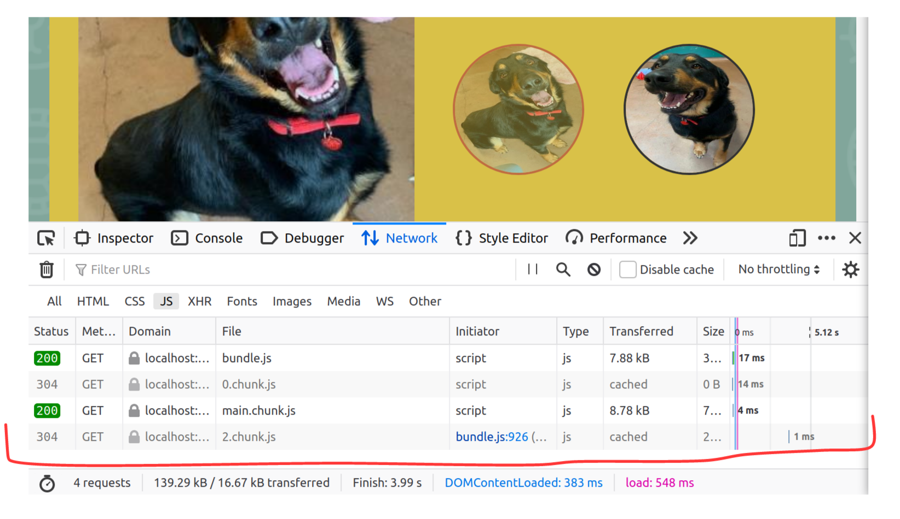

https://btholt.github.io/complete-intro-to-react-v5/

### Notes

https://frontendmasters.com/courses/intermediate-react-v2/introduction/

Use the branches to see topics covered.

### Hooks in Depth

`useState`, `useEffect`, `useContext`, and `useRef` will cover 99% of what you will use in React.

`useState` - state management

`useEffect` - do something when dependencies change/on page load

`useContext` - global state. Solves problem of passing commonly used state down to several child props

`useRef` - solves difficulties when we get into closure in Hooks. Always returns `.current` 

use cases: holding on to DOM elements, intervals, timeouts, ...

https://frontendmasters.com/courses/deep-javascript-v3/origin-of-closure/

**... and other hooks!**

`useReducer` - https://codesandbox.io/s/github/btholt/react-hooks-examples/tree/master/?file=/src/Reducer.js 

- A reducer takes old state and returns new state

`useMemo` - performance optimisation - stops React from automatically re-rendering everything when something changes as is the default behaviour. Usually not necessary if you write good code. With `useMemo` it will only change if **its dependencies** change.

`useCallback` - performance optimisation - tell React that the function isn't changing on re-render, so give me back the same one every time.

99/100 times React is fast enough, so only use these if you know there's a problem. 

`useLayoutEffect` - measures the DOM - https://codesandbox.io/s/github/btholt/react-hooks-examples/tree/master/?file=/src/LayoutEffect.js. Works just like `useEffect`. Only difference is `useLayoutEffect` is synchronous.

`useImperativeHandle` - get data to flow from child --> component. Probably never use. Maybe if you're a library author.

### Emotion

Previously taught `styled-components`. 

Compiles down to a new CSS file.

see branch: 

^ currently not working on my setup.

skip and come back later?

**^ requires babel to be correctly configured, which I've skipped** 

### Code Splitting

What if we don't need to load a part of the site immediately?

How can we have the smallest, fastest initial page load? 

**--> enter code splitting**	



(see branch *code_splitting*) 

--> we now get an extra piece of JS when we click on pet details. 

--> although this was a bad example, it's only worth it when we're dealing with large scripts (30kb?)

useful tool, but use parsimoniously 

### Server-Side Rendering

skipped - needs babel and parcel

### TypeScript

TS does a ton of stuff behind the scenes to make our lives easier and save us from bugs.

TS & VScode teams work in the same room in Microsoft, so makes sense to be using VScode :) 

Use `npx create-react-app my-app --template typescript` to create a new TS project from scratch

**Migration**

To migrate an existing JS project:

`npm install -D typescript`

`npx tsc --init`

open _tsconfig.json_ and make sure `target` and `jsx` are set to:

```json
    "target": "es2020",                          /* Specify ECMAScript target version: 'ES3' (default), 'ES5', 'ES2015', 'ES2016', 'ES2017', 'ES2018', 'ES2019', 'ES2020', or 'ESNEXT'. */
    "jsx": "react",                     /* Specify JSX code generation: 'preserve', 'react-native', or 'react'. */
    
```

and then: `npm install -D @types/react @type
s/react-dom @types/reach__router`

---

Typescript won't touch `.js` files. This means we can leave our project in a semi-migrated state :thumbsup:.

If things aren't working initially, try to remove `ts.config` and do `yarn start` again.

types are added with `:<type>`

skipped typing class components

**Rule of thumb: if the project is a one off, write in JS. If it's a long-term project, use TypeScript!** 

**Tradeoff: short term pain, long-term gain.**

### Redux

Skipping --> we now have React context. 

### Testing

**skipped**

The presenter doesn't test much UI code. It changes too rapidly. 

~~`npm install -D jest react-testing-library`~~

^ **stick to default test in package.json**: `"test": "react-scripts test"` -but we need to use `jest` ?

^^ **lib has changed**: `npm install @testing-library/react` 

put tests in a `src/__tests__/` folder with the naming convention `<component>.test.js`

put mocks under a top-level directory called `__mocks__/`


